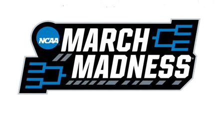
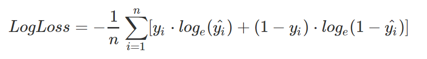
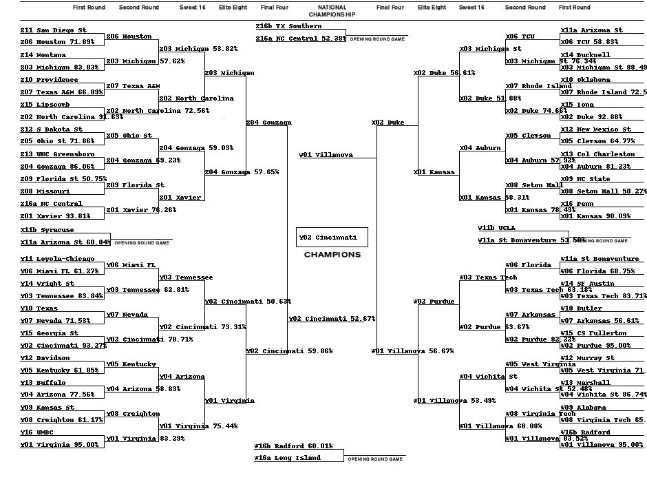

# March Madness - Kaggle Machine Learning Contest Writeup - 2018

by Kevin Dorosh
Tufts University - Class of 2018

First off, here's a link to [the code](https://github.com/kdorosh/MarchMadnessKaggleML2018/blob/master/nbs/script.ipynb).

## Inspirations

I often tell my friends that Christmas comes in March. Why?

**March Madness.** The Big Dance. 

Each March, college basketball diehards and casuals flock to make brackets. For some, it brings tears. Others, bragging rights. For the luckiest, it could even bring money.

I've made brackets for as long as I can remember -- always looking for my competitive advantage. Applying machine learning to March Madness seems natural because it's fun and the data is there.

Machine learning can help remove the bias from my decision-making. While luck is still the most important factor in a successful March Madness bracket, every edge matters.

Plus, Kaggle runs an annual machine learning March Madness [competition](https://www.kaggle.com/c/mens-machine-learning-competition-2018), providing the data I need. Entering the tourney was a no-brainer.

## High Level Idea

For the unfamiliar, a machine learning program is one that takes a set of inputs and "learns" the answer, rather than being explicity programmed.

Thus, applying machine learning to March Madness means that I'm working on creating a model that takes a set of input data (data about the teams playing), and outputs a prediction (who wins each game).

In machine learning lingo, the input data are called *features*. The features are encoded in a matrix.

The algorithm that outputs a prediction is called a *classifier*. The algorithms I'm testing are all *supervised learning* algorithms -- meaning that they are *trained* on data that is labeled (i.e., I know the results of the game). Then the same classifier is used to predict future games (provided new input).

## Features Chosen

I chose the following features because I believed that they would correlate most strongly with a team's success. I omitted information like home-court advantage because the March Madness games are supposed to be played at neutral sites. Given more time, I would have included data for ELO scores, Conference Strength, and Win Shares per 48 minutes (at the team/season level).

* NCAA March Madness Seed
* Wins

And Season Average Statistics for:

* FG%
* Turnovers
* PPG
* Opponent's PPG
* Win Margin (The difference between PPG and Opponent's PPG)

To evaluate each matchup, my feature vector was the *difference* between each team's set of features. This is beneficial because it highlights/exaggerates discrepancies between teams in a given matchup.

Admittedly, the Win Margin metric is slightly redundent (especially in the neural network model), but it still helped improve the performance of some algorithms tested. 

## Evaluating my Model

To evaluate the success of my model, I worked to minimize the negative *log loss* of my classifier. The formula:

I have linked [an explanation](https://rstudio-pubs-static.s3.amazonaws.com/157427_74913a13c3254d128bc69937434fbfa8.html) for those curious.

All you really need to know is that the confidence my model outputs in each matchup is vitally important to the evaluation of my model.

## Models Tested

Model tested and log loss 
* Multi Layer Perceptron Classifier (neural network): -0.55286
* Gradient Boosting Classifier: -0.55105
* Random Forest Classifier: -0.57830
* K-Nearest Neighbors Classifier: -0.55318
* Support Vector Classification: -0.54425
* Logistic Regression: -0.54386

The previous 4 winners of the Kaggle tournament:
* 2017 -0.438575 
* 2016 -0.481309 
* 2015 -0.43893 
* 2014 -0.52951

Going up against the pros aint easy, huh?

## Flaws with my Model

My model makes decisions based solely on the features I provide it! Just some of the important things it will overlook..

* Injuries
* Player Experience/Age
* Individual Player Matchups
* Depth of Each Team
* Whether a Team is Hot
* Strength of Schedule
* Travel/Effective Home Court Advantage (is the neutral site close enough to home-court that fans travel?)

For example, I expect my model will undervalue Missouri this year since Michael Porter Jr. (a projected top-5 NBA pick) returns from a back injury for the tournament. All of the predictive metrics my classifier uses rely upon data that would be inflated had he played all season.

Further, I find my model undervalues the seed feature, given that a 16 seed has never beaten a 1 seed (yet it only predicts ~90-95% chance of victory for the 1-seed!).

I am happy that it recognizes that Kansas vs. Penn is projected to be the closest 1 vs. 16 seed game ever played (Kansas 90.09% chance of winning). Penn is the first 16 seed to have ever cracked an ELO rating of 1700.

I would implement more of the above features if I had more time, but even this would only give incremental gains. Luck is still the most important factor; the best data scientists in the world correctly classify ~70% of the March Madness tournament. March Madness is no exact science. And that's what makes it fun.

## Lessons Learned

Some problems are more apt to being solved with machine learning than others. While March Madness is a fun problem, it is inherently too random to predict reliably.

The inherent unreliability of March Madness makes each step of the machine learning problem vitally important to a good model. The features chosen, algorithm chosen, and the tuning of the hyperparameters are all enormously important. For my model, I believe my input features offer the most room for improvement. Picking statistics that more strongly correlate with wins (even though calculating them is tedious) should bring me below 0.5 log loss.

## The Final Bracket

